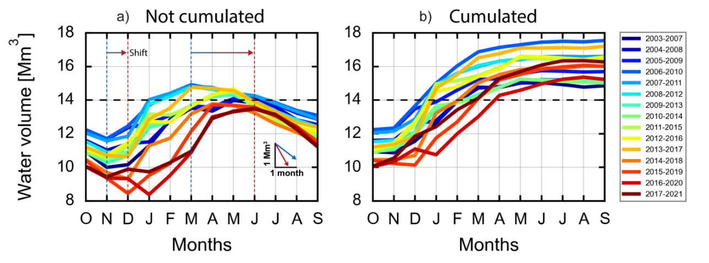

# Bienvenue !

Ceci est ma première note avec Quartz 🚀

Vous trouverez ici :
- 💻 des tutos
- 📄 mon CV
- 📚 mes projets

👉 [Voir les notes](notes/)

## Tutoriels Python

  <a href="/notes/python/conda" style="flex: 1 1 200px; border: 1px solid #ccc; padding: 1rem; text-align: center;">🛠️ Conda</a>
  <a href="/notes/linux/ssh" style="flex: 1 1 200px; border: 1px solid #ccc; padding: 1rem; text-align: center;">🔐 SSH</a>

> [!tip] Astuce Conda
> Active ton environnement avec `conda activate monenv`

> [!warning] Attention
> Ne jamais supprimer `base` !

