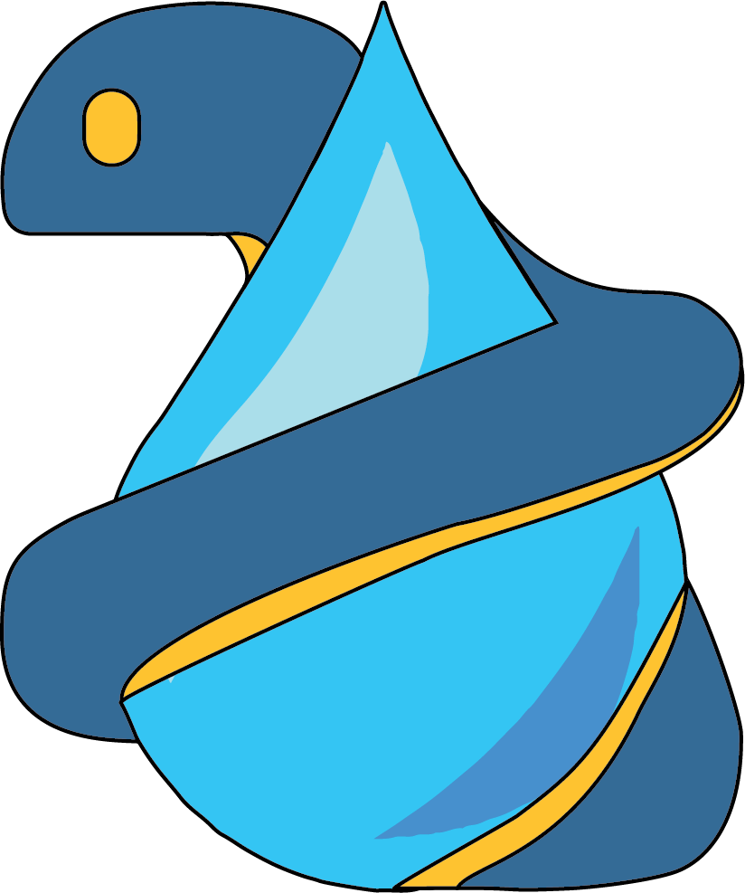

Actuellement en thèse de doctorat en modélisation hydrogéologique, je participe au développement d'outils Python pour automatiser le déploiement de modèles d'eaux souterraines. Dans le cadre de mes travaux de recherche, je me concentre sur l'amélioration de la représentation des interactions surface-subsurface dans les aquifères de socle cristallin.

Ce site rassemble mes notes techniques, scripts et réflexions sur la modélisation hydrogéologique, le développement Python et les outils géospatiaux.

---

## 📚 Navigation

  <a href="/notes/cv" style="flex: 1 1 800px; border: 2px solid var(--lightgray); border-radius: 12px; padding: 1rem; background: var(--light); text-align: center; text-decoration: none; color: inherit;">
    👨‍🎓 <strong style="color: var(--dark);">Profil</strong>
  </a>
  <a href="/notes/python" style="flex: 1 1 200px; border: 2px solid var(--lightgray); border-radius: 12px; padding: 1rem; background: var(--light); text-align: center; text-decoration: none; color: inherit;">
    🐍 <strong style="color: var(--dark);">Python</strong>
  </a>
  <a href="/notes/linux" style="flex: 1 1 200px; border: 2px solid var(--lightgray); border-radius: 12px; padding: 1rem; background: var(--light); text-align: center; text-decoration: none; color: inherit;">
    💻 <strong style="color: var(--dark);">Linux</strong>
  </a>
  <a href="/notes/dev" style="flex: 1 1 200px; border: 2px solid var(--lightgray); border-radius: 12px; padding: 1rem; background: var(--light); text-align: center; text-decoration: none; color: inherit;">
    ⚙️ <strong style="color: var(--dark);">Développement</strong>
  </a>
  <a href="/notes/sig" style="flex: 1 1 200px; border: 2px solid var(--lightgray); border-radius: 12px; padding: 1rem; background: var(--light); text-align: center; text-decoration: none; color: inherit;">
    🗺️ <strong style="color: var(--dark);">SIG</strong>
  </a>
  <a href="/notes/vrac" style="flex: 1 1 200px; border: 2px solid var(--lightgray); border-radius: 12px; padding: 1rem; background: var(--light); text-align: center; text-decoration: none; color: inherit;">
    🗂️ <strong style="color: var(--dark);">Vrac</strong>
  </a>

---

## 🚀 Projets de recherche

  <a href="https://gitlab.com/Alex-Gauvain/HydroModPy/-/tree/dev?ref_type=heads" style="flex: 1 1 300px; border: 2px solid var(--lightgray); border-radius: 12px; padding: 1.5rem; background: var(--light); text-decoration: none; color: inherit; display: block;">
    

      
      

        <strong style="font-size: 1.2rem; color: var(--dark);">HydroModPy</strong> 
        <small style="color: var(--gray);">Boîte à outils Python pour la modélisation hydrogéologique</small>
      

    

    <small style="color: var(--darkgray);">HydroModPy automatise le déploiement de modèles d'eaux souterraines. Ma contribution : développement de la modélisation des réservoirs et lacs.</small>  
    Python
    MODFLOW
  </a>
  
  <a href="https://gitlab.com/AlexandreCoche/geop4th" style="flex: 1 1 300px; border: 2px solid var(--lightgray); border-radius: 12px; padding: 1.5rem; background: var(--light); text-decoration: none; color: inherit; display: block;">
    

      
      

        <strong style="font-size: 1.2rem; color: var(--dark);">GeoP4th</strong> 
        <small style="color: var(--gray);">Plateforme de traitement de trajectoires spatio-temporelles</small>
      

    

    <small style="color: var(--darkgray);">Collection d'outils Python pour standardiser les données spatio-temporelles. Ma contribution : développement d'outils pour l'analyse des trajectoires.</small>  
    Python
    Géospatial
  </a>

---

## 🔗 Contact & Liens

  
  
  
  
  
  
  
  
  
  
  

  <a href="mailto:bastien.boivin@univ-rennes.fr" style="display: flex; align-items: center; gap: 0.5rem; padding: 0.75rem 1rem; border: 2px solid var(--lightgray); border-radius: 8px; background: var(--light); text-decoration: none; color: inherit;">
    🏛️
    <strong style="color: var(--dark);">Mail professionnel</strong>
  </a>
  
  <a href="mailto:bastien.boivin@proton.me" style="display: flex; align-items: center; gap: 0.5rem; padding: 0.75rem 1rem; border: 2px solid var(--lightgray); border-radius: 8px; background: var(--light); text-decoration: none; color: inherit;">
    📧
    <strong style="color: var(--dark);">Mail personnel</strong>
  </a>

